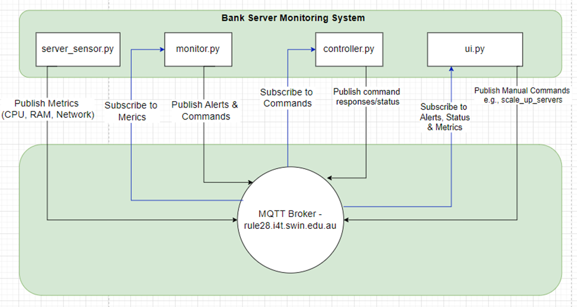

# Bank Server DoS Monitoring System (MQTT-Based)

## Project Overview

The **Bank Server DoS Monitoring System** is an MQTT-based application designed to monitor bank server resources (CPU, RAM) and network traffic to detect and respond to potential Denial of Service (DoS) attacks. The system uses a **publish-subscribe** architecture and consists of four main components:

- **Sensors**: Deployed on the bank server to publish metrics (e.g., CPU usage, RAM usage).
- **Monitoring System**: Detects abnormal behavior and triggers alerts.
- **Controller**: Acts as a load balancer to scale up the server or enable rate-limiting during an attack.
- **User Interface**: Displays server metrics and alerts, and allows administrators to send commands.

## Project Report

Please refer to the **{Project_Report_JADE.pdf}** for more details about the components, architecture, and cybersecurity analysis of the project.

## Problem Statement

Financial institutions face threats from DoS attacks that can disrupt banking services and compromise customer trust. This system addresses the following needs:

- Real-time detection of DoS attacks.
- Effective monitoring of server resource usage.
- Automation of threat responses to minimise downtime.
- Clear insights into system performance and security.

## System Overview

The system consists of four components:

1. **Server Sensor (server_sensor.py)**: Collects and publishes system metrics (CPU, RAM, network traffic).
2. **Monitoring System (monitor.py)**: Analyses metrics to detect anomalies and trigger alerts.
3. **Controller (controller.py)**: Responds to attacks by dynamically scaling server resources or enabling rate-limiting.
4. **User Interface (ui.py)**: Visualises server metrics and alerts in real-time.

## Running Instructions

### Prerequisites

- Python 3.x
- Pip package manager
- Paho-mqtt library for MQTT client communication
- Tkinter (pre-installed with Python)

### Installation

Install the required Python package:

```bash
pip install paho-mqtt
```

### Running the System

1. Start the **Server Sensor**:

```bash
python server_sensor.py
```

2. Start the **Monitoring System**:

```bash
python monitor.py
```

3. Start the **Controller**:

```bash
python controller.py
```

4. Launch the **UI**:

```bash
python ui.py
```

## Architecture Diagram



## Workflow Scenario

1. **Server Sensor**: Collects data on CPU, RAM, and network traffic every 5 seconds and publishes it to MQTT topics.
2. **Monitor**: Detects an unusual spike in network traffic indicating a potential DoS attack.
3. **Alert**: Monitor generates an alert, triggering rate-limiting via the **Controller**.
4. **Controller**: Implements rate-limiting and updates the system status.
5. **UI**: Displays real-time metrics, alerts, and rate-limiting status.

## Communication Topics

This project uses the following MQTT topics:

### Private Topics

- `<103795587>/bank_server/metrics/cpu`: CPU usage metrics
- `<103795587>/bank_server/metrics/ram`: RAM usage metrics
- `<103795587>/bank_server/metrics/network`: Network traffic metrics
- `<103795587>/bank_server/alerts`: System alerts
- `<103795587>/bank_server/control/command`: Control commands for load balancing
- `<103795587>/bank_server/status/scaling`: Status of scaling commands
- `<103795587>/bank_server/status/rate_limiting`: Status of rate-limiting commands

### Public Topic

- `public/#`: Public messages

---

For detailed information on the components, architecture, and cybersecurity analysis, please refer to the **{Project_Report_JADE.pdf}** file.